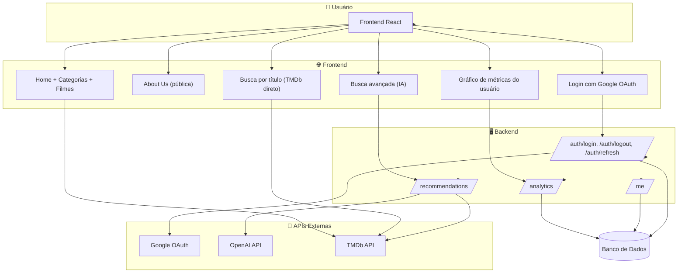

# 🎬 MovieMind - Recomendações Inteligentes de Filmes
Plataforma de recomendação de filmes personalizada para seus interesses pessoais.

O **MovieMind** é um projeto que combina **React**, **Node.js**, **OpenAI API** e **TMDb API** para gerar recomendações de filmes personalizadas com base nos desejos do usuário.  
A aplicação utiliza inteligência artificial para sugerir títulos e, em seguida, busca detalhes (pôster, sinopse, avaliação) na API do The Movie Database.

---

## 🚀 Tecnologias Utilizadas

### **Frontend** – React
- Construção da interface interativa.
- Formulário para captura das preferências do usuário.
- Exibição dinâmica dos filmes retornados pelo backend.
- Histórico de pesquisas por período (ex: quantidade de buscas por dia/semana). -> gráfico

### **Backend** – Node.js + Express
- Integração com a **OpenAI API** para gerar uma lista de títulos de filmes.
- Consulta à **API do TMDb** para buscar informações completas sobre os títulos.
- OAUTH com Google API para criação de contas (unico meio de login).
- Rota de favoritos (opcional)
- Rota de histórico de buscas abstratas.

### **API Externa** – TMDb
- Fonte de dados de filmes, incluindo:
  - Pôsteres
  - Sinopses
  - Datas de lançamento
  - Avaliações

### **IA** – OpenAI API
- Interpretação das preferências do usuário.
- Geração de lista de títulos relevantes e coerentes.

---

## 📂 Estrutura do Projeto

/frontend → Aplicação React

/backend → API Node.js


---

## 🔄 Fluxo de Funcionamento

1. **Usuário** informa suas preferências de filmes no frontend.
2. **Backend** recebe as preferências e envia para a OpenAI API.
3. **OpenAI API** retorna títulos de filmes que combinam com os desejos.
4. **Backend** consulta a TMDb API para cada título.
5. **Frontend** exibe os filmes com imagem, sinopse, nota e data de lançamento.




---

## ⚙️ Como Rodar o Projeto

### 1. Clonar o repositório
```bash
git clone https://github.com/SantosVicente/MovieMind.git
```
### 2. Backend

```bash
cd backend
npm install
# Criar um arquivo .env com as chaves:
# OPENAI_API_KEY=chave_da_openai
# TMDB_API_KEY=chave_do_tmdb
# DATABASE_URL="file:./dev.db"
# PORT=3002
# JWT_SECRET="" //// um jwt qualquer para segurança
# GOOGLE_CLIENT_ID="" //seu client id criado no google console 
# GOOGLE_CLIENT_SECRET="" //seu client secret criado no google console
# GOOGLE_CALLBACK_URL=http://localhost:3002/auth/google/callback
npm run dev
cd ..
```

### 3. Frontend

```bash
cd frontend
npm install
# Criar um arquivo .env com as chaves:
# NEXT_PUBLIC_TMDB_API_URL=https://api.themoviedb.org/3
# NEXT_PUBLIC_TMDB_API_KEY= //crie sua chave no site do TMDB
# NEXT_PUBLIC_BACKEND_URL=http://localhost:3002
npm run dev
```

🔑 APIs externas utilizadas:

OpenAI: https://platform.openai.com
TMDb: https://developer.themoviedb.org
---

# 📝 Requisitos do Projeto

## Requisitos Funcionais (RF)

Descrevem o que o sistema deve fazer. São as funcionalidades que o usuário final ou o próprio sistema precisa executar.

    RF1: O usuário deve ser capaz de descrever suas preferências de filmes em um formulário de texto livre.

    RF2: O sistema deve enviar a descrição do usuário para a API de IA.

    RF3: A API de IA deve interpretar a descrição e retornar uma lista de títulos de filmes relevantes.

    RF4: O sistema deve usar a lista de títulos para buscar informações detalhadas (sinopse, pôster, avaliação, data de lançamento) na API do TMDb.

    RF5: A aplicação deve exibir uma lista de filmes recomendados, incluindo o pôster, título, ano de lançamento, nota e sinopse.

    RF6: O sistema deve lidar com títulos que não sejam encontrados nas APIs e informar o usuário de forma adequada.

    RF7: O usuário deve ser capaz de visualizar a interface tanto em dispositivos desktop quanto móveis (responsividade).

## Requisitos Não Funcionais (RNF)

Descrevem como o sistema deve funcionar, focando em qualidades como desempenho, usabilidade, segurança e escalabilidade.

    RNF1 - Usabilidade: A interface deve ser intuitiva e de fácil uso, permitindo que o usuário envie suas preferências com poucos cliques.

    RNF2 - Desempenho: A aplicação deve ser ágil. As recomendações devem ser exibidas em menos de 10 segundos, considerando a comunicação com as duas APIs externas.

    RNF3 - Confiabilidade: O sistema deve ser capaz de lidar com falhas de conexão às APIs externas, apresentando mensagens de erro claras ao usuário.

    RNF4 - Segurança: As chaves de API (OPENAI_API_KEY, TMDB_API_KEY) devem ser armazenadas de forma segura no backend (em variáveis de ambiente) e nunca expostas no código frontend.

    RNF5 - Escalabilidade: A arquitetura do projeto (frontend e backend separados) deve permitir o crescimento futuro, como a adição de novas funcionalidades ou o aumento do número de usuários sem comprometer a performance.

    RNF6 - Manutenibilidade: O código deve ser organizado e bem documentado, facilitando a manutenção e a adição de novas funcionalidades por outros desenvolvedores.
