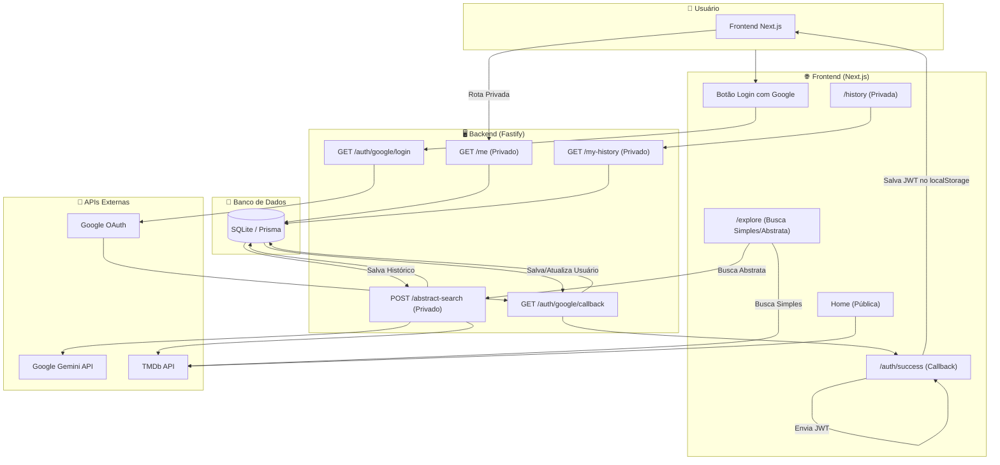

# 🎬 MovieMind - Recomendações Inteligentes de Filmes
Plataforma de recomendação de filmes personalizada para seus interesses pessoais.

O **MovieMind** é um projeto que combina **Next.js (React)**, **Node.js (Fastify)**, **Google Gemini API** e **TMDb API** para gerar recomendações de filmes personalizadas com base nos desejos do usuário. A aplicação utiliza inteligência artificial para sugerir títulos e, em seguida, busca detalhes (pôster, sinopse, avaliação) na API do The Movie Database.

---

## 🚀 Tecnologias Utilizadas

### **Frontend** – React
- Construção da interface interativa.
- Busca Simples: Consulta direta à API do TMDb.
- Busca Abstrata: Formulário para captura de descrições complexas do usuário.
- Exibição dinâmica dos filmes retornados pelo backend.
- Página de Histórico: Exibe as buscas abstratas anteriores do usuário.
- Autenticação: Gerenciamento de estado de login via React Context.

### **Backend** – Node.js + Fastify
- API REST robusta e de alta performance usando Fastify.
- Validação de rotas e schemas com Zod.
- Autenticação: OAUTH com Google API (único meio de login) e gerenciamento de sessão com JWT (fastify-jwt).
- Banco de Dados: Persistência de usuários e histórico com Prisma e SQLite.
- Rota /abstract-search: Integração com a Google Gemini API para gerar uma lista de títulos de filmes com base na descrição.
- Rotas Protegidas: Rotas /me, /abstract-search e /my-history protegidas por autenticação JWT.

### **API Externa** – TMDb
- Fonte de dados de filmes, incluindo:
  - Pôsteres
  - Sinopses
  - Datas de lançamento
  - Avaliações

### **IA** – OpenAI API
- Interpretação das descrições abstratas do usuário.
- Geração de lista de 10 títulos de filmes relevantes, com resposta forçada em JSON.

---

## 📂 Estrutura do Projeto

/frontend → Aplicação Next.js (App Router)

/backend → API Node.js (Fastify + Prisma)

---

## 🔄 Fluxo de Funcionamento

1. **Usuário** faz login com Google OAuth. O **Backend** cria um usuário no DB e retorna um JWT.
2. **Frontend** armazena o JWT e o utiliza para requisitar rotas privadas (como /me ou /abstract-search).
3. **Usuário** descreve suas preferências na "Busca Abstrata".
4. **Backend** (rota /abstract-search) recebe a descrição e envia para a Google Gemini API.
5. **Gemini API** retorna 10 títulos de filmes em formato JSON que se parecem com a descrição do usuário.
6. **Backend** consulta a TMDb API para cada um dos 10 títulos em paralelo.
7. **Backend** salva a descrição e os resultados no banco de dados (tabela SearchHistory).
8. **Frontend** exibe os 10 filmes com imagem, sinopse, nota e data de lançamento.




---

## ⚙️ Como Rodar o Projeto

### 1. Clonar o repositório
```bash
git clone https://github.com/SantosVicente/MovieMind.git
```
### 2. Backend

```bash
cd backend
npm install
# Criar um arquivo .env com as chaves:
DATABASE_URL="file:./dev.db"
PORT=3004
JWT_SECRET="seu-segredo-jwt-aqui"
GOOGLE_CLIENT_ID="seu-client-id-do-google"
GOOGLE_CLIENT_SECRET="seu-client-secret-do-google"
GOOGLE_CALLBACK_URL=http://localhost:3004/auth/google/callback
GEMINI_API_KEY="sua-chave-da-api-gemini"
TMDB_API_URL=https://api.themoviedb.org/3
TMDB_API_KEY="sua-chave-bearer-v4-do-tmdb"

npx prisma migrate dev --name init
npm run dev
cd ..
```

### 3. Frontend

```bash
cd frontend
npm install
# Criar um arquivo .env com as chaves:
# NEXT_PUBLIC_TMDB_API_URL=https://api.themoviedb.org/3
# NEXT_PUBLIC_TMDB_API_KEY= //crie sua chave no site do TMDB
# NEXT_PUBLIC_BACKEND_URL=http://localhost:3004
npm run dev
```

🔑 APIs externas utilizadas:

Google Gemini: https://aistudio.google.com/app/apikey
TMDb: https://developer.themoviedb.org
---

# 📝 Requisitos do Projeto

## Requisitos Funcionais (RF)

Descrevem o que o sistema deve fazer. São as funcionalidades que o usuário final ou o próprio sistema precisa executar.

    RF1: O usuário deve ser capaz de descrever suas preferências de filmes em um formulário de texto livre.

    RF2: O sistema deve enviar a descrição do usuário para a API de IA.

    RF3: A API de IA deve interpretar a descrição e retornar uma lista de títulos de filmes relevantes.

    RF4: O sistema deve usar a lista de títulos para buscar informações detalhadas (sinopse, pôster, avaliação, data de lançamento) na API do TMDb.

    RF5: A aplicação deve exibir uma lista de filmes recomendados, incluindo o pôster, título, ano de lançamento, nota e sinopse.

    RF6: O sistema deve lidar com títulos que não sejam encontrados nas APIs e informar o usuário de forma adequada.

    RF7: O usuário deve ser capaz de visualizar a interface tanto em dispositivos desktop quanto móveis (responsividade).

## Requisitos Não Funcionais (RNF)

Descrevem como o sistema deve funcionar, focando em qualidades como desempenho, usabilidade, segurança e escalabilidade.

    RNF1 - Usabilidade: A interface deve ser intuitiva e de fácil uso, permitindo que o usuário envie suas preferências com poucos cliques.

    RNF2 - Desempenho: A aplicação deve ser ágil. As recomendações devem ser exibidas em menos de 10 segundos, considerando a comunicação com as duas APIs externas.

    RNF3 - Confiabilidade: O sistema deve ser capaz de lidar com falhas de conexão às APIs externas, apresentando mensagens de erro claras ao usuário.

    RNF4 - Segurança: As chaves de API (GEMINI_API_KEY, TMDB_API_KEY, JWT_SECRET) devem ser armazenadas de forma segura no backend (em variáveis de ambiente) e nunca expostas no código frontend.

    RNF5 - Escalabilidade: A arquitetura do projeto (frontend e backend separados) deve permitir o crescimento futuro, como a adição de novas funcionalidades ou o aumento do número de usuários sem comprometer a performance.

    RNF6 - Manutenibilidade: O código deve ser organizado e bem documentado, facilitando a manutenção e a adição de novas funcionalidades por outros desenvolvedores.
